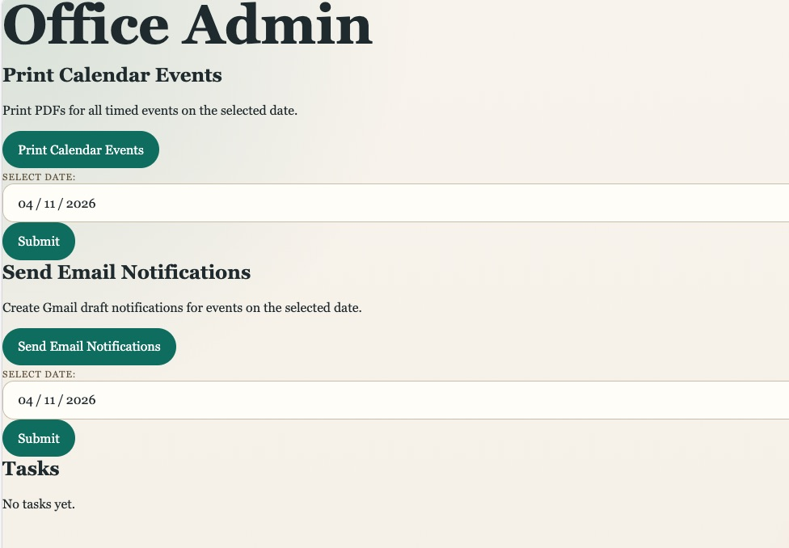

# office-admin-claude-impl
Office automation sample using the administrator framework implemented using Anthropic's Claude Code.

## Environment setup

This project uses uv.

### First-time setup
uv sync

### Run the app
uv run main.py
